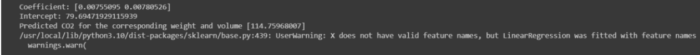

# Implementation of Multivariate Linear Regression
## Aim
To write a python program to implement multivariate linear regression and predict the output.
## Equipment’s required:
1.	Hardware – PCs
2.	Anaconda – Python 3.7 Installation / Moodle-Code Runner
## Algorithm:
### Step1
Import pandas as pd.
### Step2
Read csv file.
### Step3
Get the value of x and y variables.
### Step4
Create the linear regression model and fit.
### Step5
Predict the c02 emission of a car where the weight is 2300kg,and the volume is 1300cm cube. Print the predicted output.

## Program:
```
import pandas as pd
from sklearn import linear_model
data=pd.read_csv("cars.csv")
X=data[["weight","volume"]]
Y=data["CO2"]
regr=linear_model.LinearRegression()
regr.fit(X,Y)
print("coefficient:",regr.coef_)
print("Intercept:",regr.intercept_)
predictC02=regr.predict([[3300,1300]])
print("prediction C02 for corresponding weight and volume",predictC02)

```
## Output:


## Result
Thus the multivariate linear regression is implemented and predicted the output using python program.